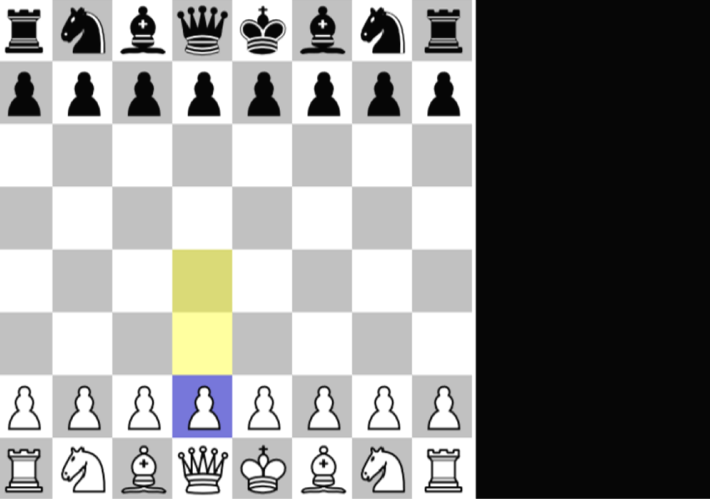
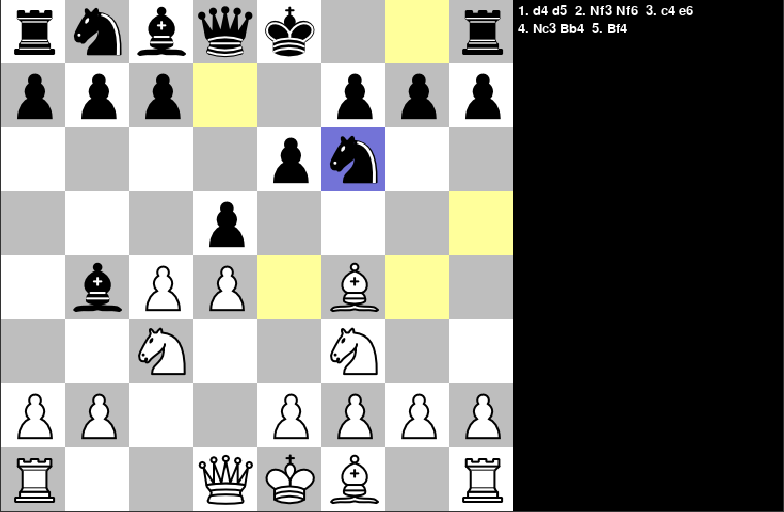
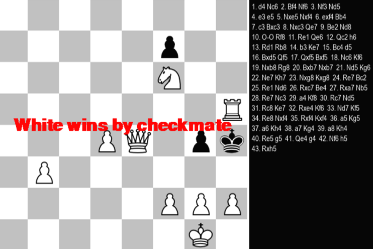

# ♟️ Chess with AI

Chess with AI: A Python-based chess engine and interactive board designed with a simple, intuitive interface and a challenging AI opponent. Built using **Pygame**, this project lets you experience both player vs player and player vs AI modes directly on your machine.

[](LICENSE)
[](https://github.com/xHarshit/Chess-with-AI/issues)
[](https://github.com/xHarshit/Chess-with-AI/stargazers)

---

## 🧠 Smart Chess Engine

This chess engine utilizes the **Minimax algorithm with Alpha-Beta Pruning**, giving it the ability to make calculated and strategic decisions. It evaluates all possible outcomes to select the most optimal move—providing a solid challenge to even experienced players.

---

## 📸 Visual Preview

**Screenshot 1**  


**Screenshot 2**  


**Screenshot 3**  


---

## 🚀 Features

- 🧩 **AI Opponent**: Based on Minimax with Alpha-Beta Pruning.
- 🎮 **Game Modes**: Player vs Player, Player vs AI.
- 👆 **Clickable Interface**: Click to select and move pieces.
- 🕹️ **Undo / Reset**: Easily undo moves or restart the game.
- 📋 **Move Logger**: Track every move made in the session.
- ♟️ **Realistic Movement**: Enforces legal moves and game rules.

---

## 🛠️ Tech Stack

- Python 3
- Pygame

---

## 📂 Project Structure

```
Chess-with-AI/
│
├── ChessMain.py         # Main game loop and UI
├── ChessEngine.py       # Core logic for move generation and validation
├── ChessAI.py           # Minimax-based AI logic
├── images/              # Game assets (pieces, board)
├── screenshots/         # Project preview images
├── requirements.txt     # Dependencies (Pygame)
├── LICENSE              # MIT License
└── README.md            # You're here!
```

---

## ⚙️ Getting Started

Follow these steps to set up the project locally:

```bash
git clone https://github.com/xHarshit/Chess-with-AI.git
cd Chess-with-AI
python -m pip install -r requirements.txt
python ChessMain.py
```

---

## 🎮 Controls

- Press **Z** → Undo last move  
- Press **R** → Reset the game  
- **Click** → Select and move pieces  

---

## 🧩 Future Enhancements

- [ ] Improve AI with move ordering and opening book  
- [ ] Implement drag-and-drop piece movement  
- [ ] Add board flip and dark mode options  
- [ ] Enhance UI with piece skins and animations  

---

## 📄 License

This project is licensed under the [MIT License](LICENSE). Feel free to use and modify it for your own learning or projects. ;)
